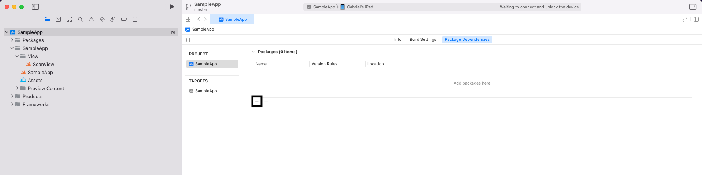
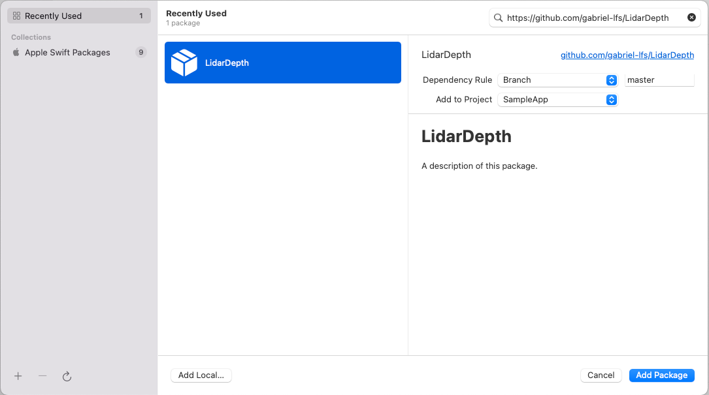

# LidarDepth
#### Biblioteca com o intuito de simplificar a utilização do LiDAR para recuperar as medidas de cada pixel e fazer a digitalização 3D.

## Utilização

Para utilizar, deve-se importar a biblioteca como um Swift Package no projeto navegando nas especificações do projeto. 

`project > package dependencies e clicar no +`

colocar o caminho desse repositório na barra de busca, quando o pacote aparecer, clicar em add package

Essa biblioteca é um compilado de códigos necessários para a criação de um modelo 3D apartir dos escaneamentos utilizando o ARKit com auxilio do LiDAR. Também para a medição de distancia por pixel detectado pela Depth API.

Como exemplo foi criada uma aplicação utilizando essa biblioteca, a https://github.com/gabriel-lfs/SampleLiDARApp

## Referencial
Os seguintes codigos Open Source foram utilizados como base para esse projeto:
https://developer.apple.com/documentation/arkit/content_anchors/visualizing_and_interacting_with_a_reconstructed_scene
https://developer.apple.com/documentation/arkit/environmental_analysis/displaying_a_point_cloud_using_scene_depth
 https://github.com/zeitraumdev/iPadLIDARScanExport
